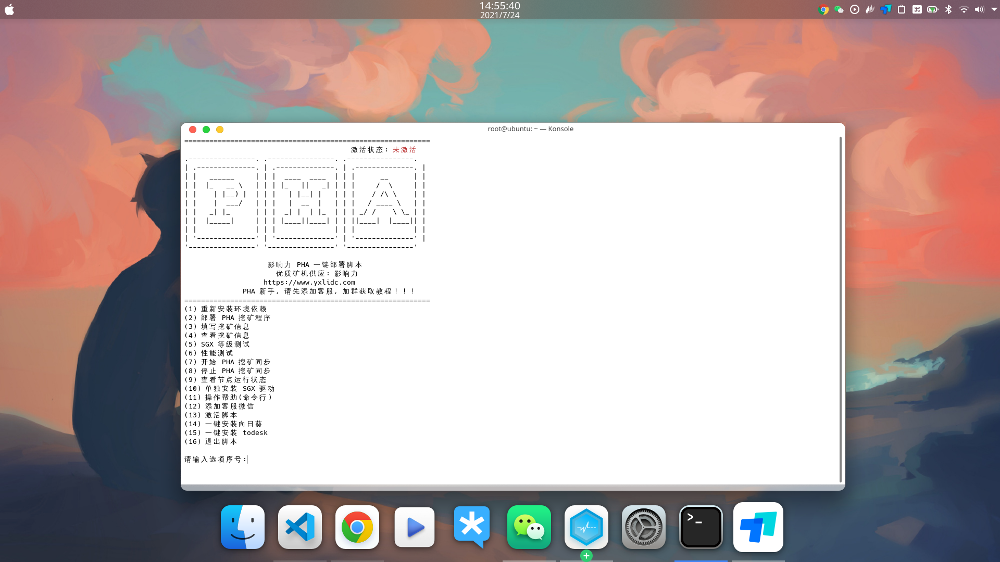
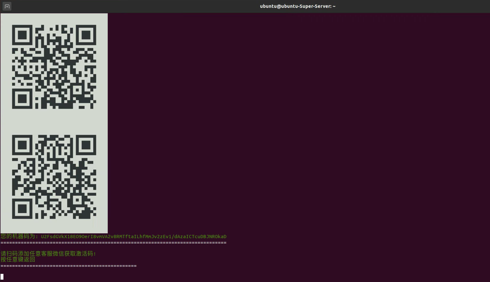

# pha_onekey

> Phala Deploy Script for One Key 

English| [简体中文](./README_cn.md)

current version: 2.0

### Ability

- automatic init pha environment
- automatic start pha sync
- SGX level test
- Score test
- SGX driver repair
- Installation sunloginclient/todesk for one key

### First install

- in terminal: 

```bash
curl -o pha https://github.com/xujing-CZ/pha_onekey/raw/master/pha && sudo chmod +x pha && ./pha
```
### Follow up use

- in terminal:
```bash
pha
```

- Select the corresponding option according to the serial number

    

### FAQ

1. Dependency installation failed
    * The script installs the necessary dependent environment by default when it starts, but if the network is too poor, the following situations will occur
    * 

- Solution: 
    * close the terminal
    * Re-open the terminal, enter pha => Enter to enter the program
    * select  `(1) 重新安装环境依赖` 
    * If the execution still fails, check the network, restart the system, repeat the above steps, and add customer service
    * 

2. Installation dependency stuck
    * If the image has been released for a period of time, for example, `Ubuntu20.04` was released in 2020, and there are too many packages to be upgraded, it may be stuck (it will be stuck here for dozens of minutes)
    * 

- Solution:
    * close the terminal、restart the system
    * Re-open the terminal, enter pha => Enter to enter the program
    * select  `(1) 重新安装环境依赖` 
    * If the execution still fails, check the network, restart the system, repeat the above steps, and add customer service


3. About activation
    * After the script is installed, the default state is not activated
    * select `(12) 添加客服微信` Send the machine code to customer service
    * When you receive the activation code sent by the customer service, select `(13) 激活脚本` to paste the activation code into the script activation
    * 
    * 
    * 
    * 

4. For other questions, add customer service WeChat, customer service will pull you into the wechat group
