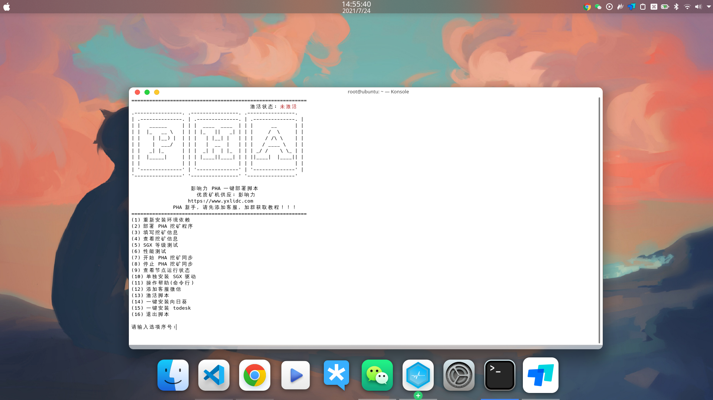
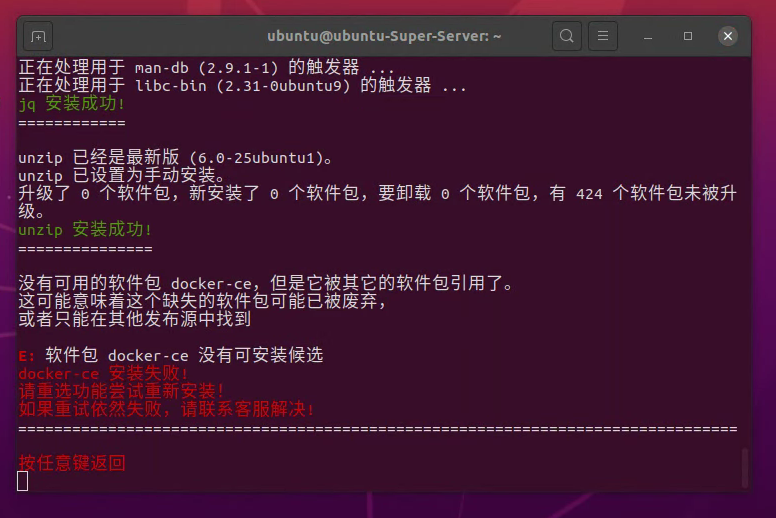
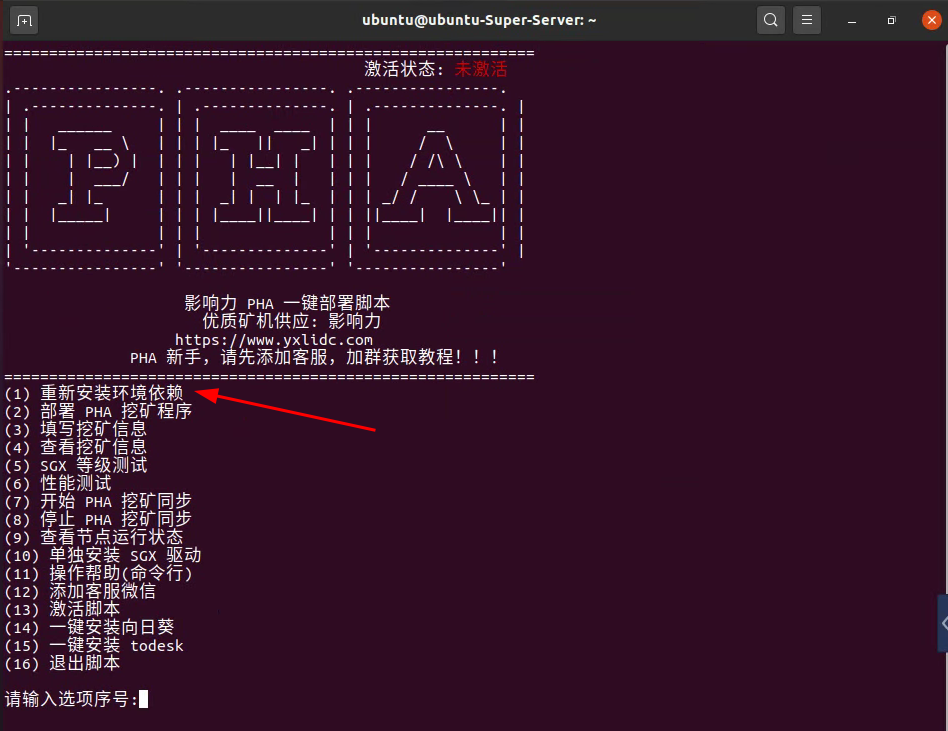
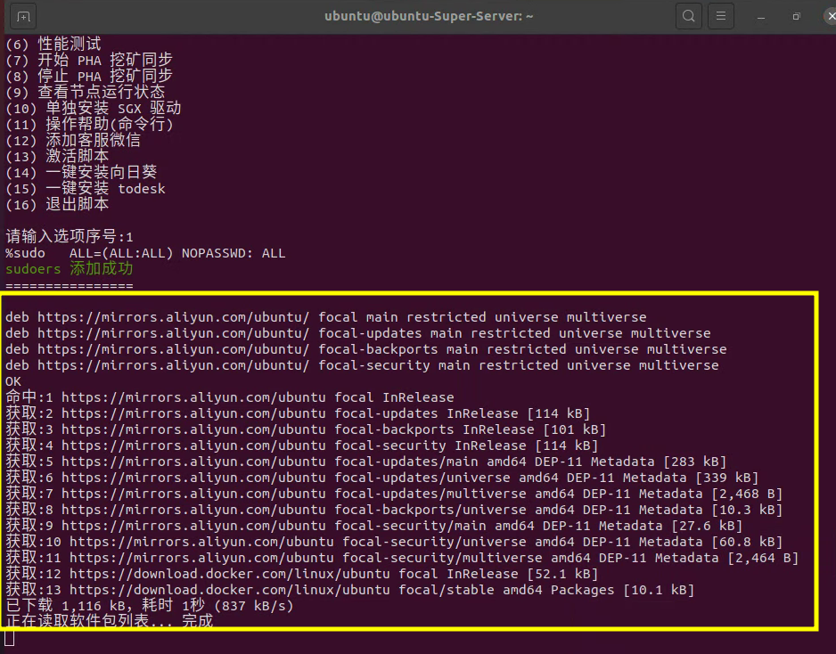
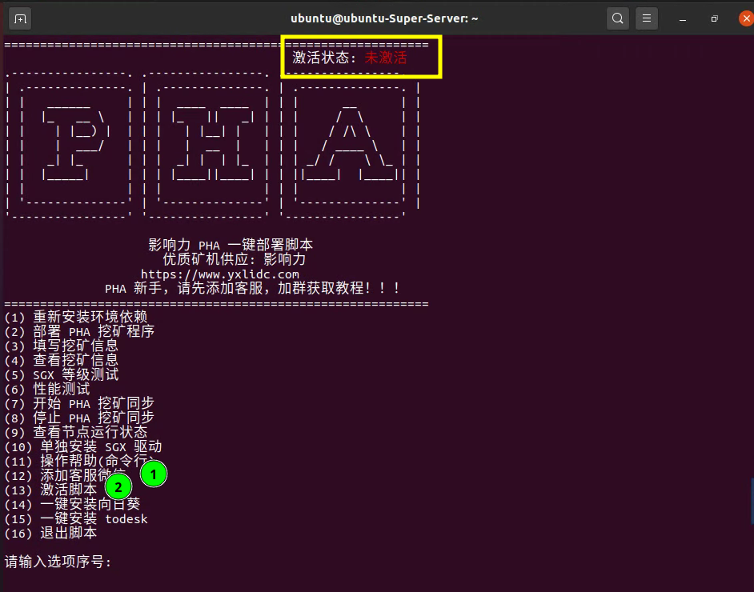
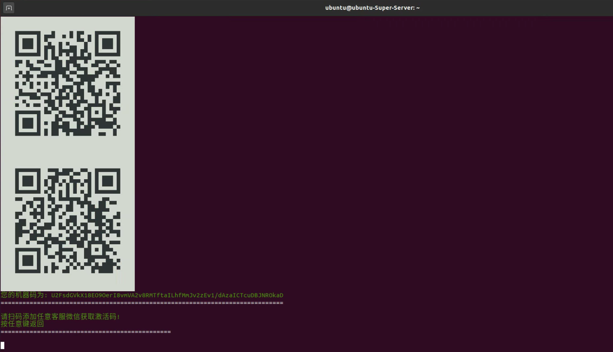
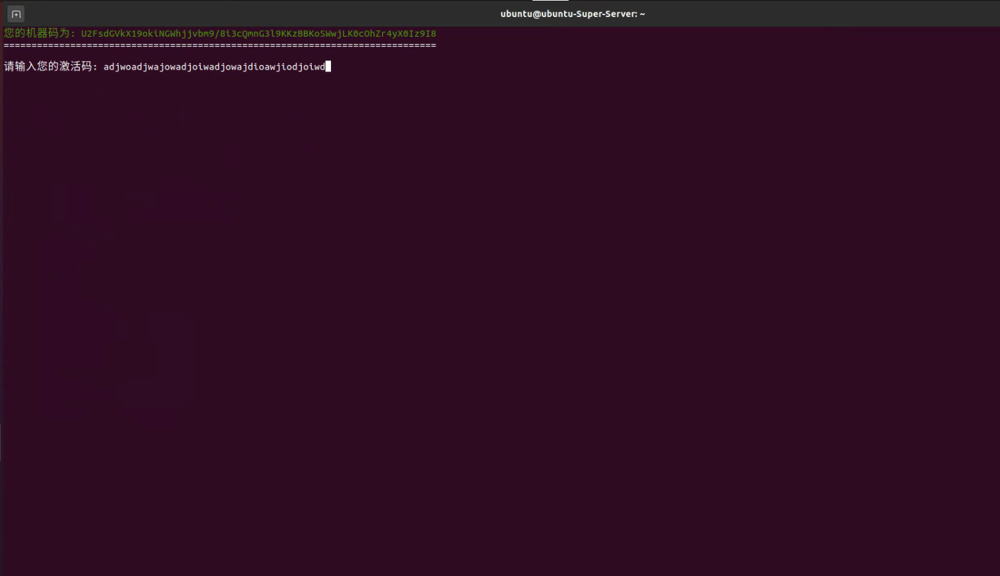
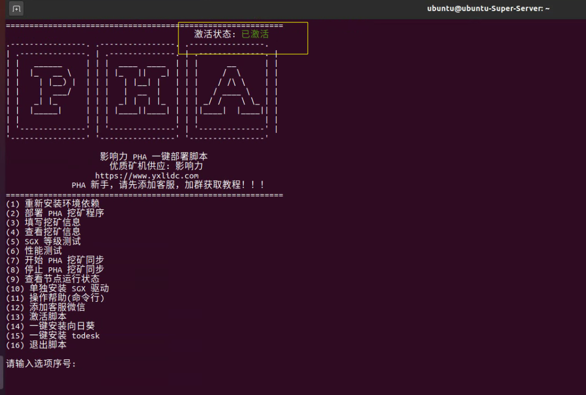

# pha_onekey

>上禾云储 PHA 环境一键部署脚本  

[English](./README.md) | 简体中文

当前版本: 2.0

### 脚本主要功能
- 一键部署 PHA
- 一键挖矿同步
-  SGX 等级测试
-  Score_test 性能测试
-  SGX 驱动修复
-  一键安装向日葵
-  一键安装 todesk

### 初次安装

- 在 Ubuntu 终端下，执行以下命令:

```bash
curl -o pha https://gitee.com/xujing-CZ/pha_onekey/raw/master/pha && sudo chmod +x pha && ./pha
```
### 后续使用

- 在 Ubuntu 终端下，执行以下命令:
```bash
pha
```

- 按序号选择对应的选项即可

    

### 常见问题

1. 依赖安装失败问题
    * 脚本在启动时默认安装必备的依赖环境，但是如果网络太差会出现如下情况
    * 

- 解决方法: 
    * 关闭当前终端
    * 重新开启终端，输入 pha => 回车进入程序
    * 选择 `(1) 重新安装环境依赖` 
    * 如果执行依旧出错，检查网络、重启系统、重复以上几步，添加客服
    * 

2. 安装依赖卡死问题
    * 如果镜像从发布已有一段时间，例如 `Ubuntu20.04` 发布于 2020 年，要升级的软件包过多，有可能出现卡住的情况(几十分钟都卡在这里)
    * 

- 解决方法:
    * 关闭当前终端，重启系统
    * 重新开启终端，输入 pha => 回车进入程序
    * 选择 `(1) 重新安装环境依赖` 


3. 关于激活
    * 脚本安装后，默认状态未激活
    * 选择 `(12) 添加客服微信` 将机器码发给客服
    * 收到客服发送的激活码时，选择 `(13) 激活脚本` 将激活码粘贴到脚本激活
    * 
    * 
    * 
    * 

4. 其他问题，添加客服微信，客服会拉你进群
